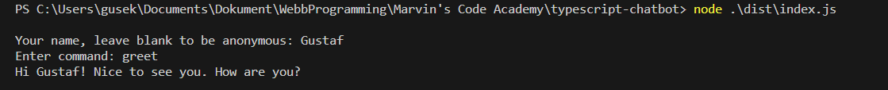
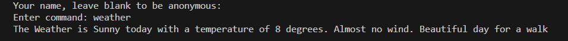
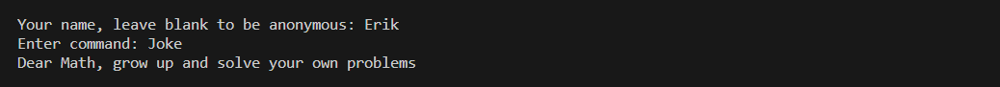

# Chatbot
This application is a chatbot that responds to a set amount of commands. The user interacts with the chatbot using a CLI interface.  
The app focuses on the use of core aspects of typescript. 

## Installation and Setup

The application uses TypeScript, therefore make sure you have typescript installed. 
Run the following command in the root folder to launch the application:


```
node .\dist\index.js
```

The typescript compiler outputs compiled JavaScript code to the dist folder. If changes are made run this command in the project folder using your terminal window:

````
tsc
````
This recompiles the code and updates `index.js`.

## Usage examples
The Chatbot responds with messages that should be considered an example. Below is some examples of how the application works.  

### Example 1 ( Greet command )


### Example 2 ( Weather command )


### Example 3 ( Joke command )


### Running Tests

To run test located in the tests folder, run the following command in the terminal:

``````
npm test
``````
This will run the test-suite which tests each part of the application using several unit-tests.  
The tests uses Jest as a testing library and each test has a similar implementation, an example can be seen below:

``````ts
describe("WeatherCommand", (): void =>{
  it("should return a message with information about the weather", (): void =>{
    const result = new WeatherCommand().execute();
    expect(result.toLowerCase()).toMatch(/weather/);
  });
});
``````
## Project Structure
The project folder is structured as follows:

``````

dist/
Images/
node_modules
tests/
ChatBot.ts
index.ts
package-lock.json
package.json
README.md
tsconfig.json

``````
- `dist` folder contains all the compiled JavaScript code that runs the application
- `Images` contains images used in the project, mainly in the README.
- `ChatBot.ts` is the actual implementation of the chatbot. How it should respond and behave. 
- `index.ts` The main application loop and user interactions. 
- `tests` folder contains the testsuite for the application which contain different unit-tests.


## Technologies Used
The project uses the following languages:
- TypeScript

### Libraries used
- Jest

